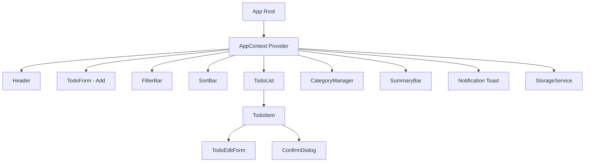
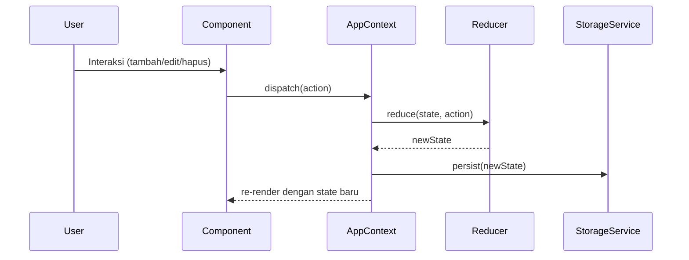

# Design Document: Todo-List App

## Overview

Aplikasi Todo-List Front-End adalah aplikasi web single-page (SPA) berbasis React yang memungkinkan pengguna mengelola daftar tugas secara efisien langsung di browser. Aplikasi ini dibangun dengan React sebagai library UI dan Tailwind CSS untuk styling, tanpa backend — seluruh data disimpan di Local Storage browser.

Fitur utama meliputi:
- CRUD lengkap untuk todo (buat, baca, perbarui, hapus)
- Kategorisasi, prioritas, dan tanggal jatuh tempo
- Filter multi-kriteria dan pencarian teks bebas
- Pengurutan berdasarkan berbagai atribut
- Manajemen kategori
- Persistensi data via Local Storage
- Antarmuka responsif dengan dukungan dark mode

---

## Architecture

Aplikasi menggunakan arsitektur komponen React dengan state management terpusat melalui `useReducer` + `Context API`. Tidak ada server-side rendering atau backend; semua logika berjalan di sisi klien.



### Aliran Data



### Keputusan Arsitektur

- **useReducer + Context** dipilih daripada Redux karena skala aplikasi kecil-menengah dan tidak memerlukan middleware kompleks.
- **Local Storage** sebagai satu-satunya storage karena tidak ada kebutuhan sinkronisasi antar perangkat.
- **Tailwind CSS** untuk utility-first styling yang konsisten dan responsif tanpa CSS custom yang besar.
- **Komponen terkontrol** untuk semua form input agar validasi mudah dilakukan sebelum dispatch.

---

## Components and Interfaces

### AppContext

Menyediakan state global dan dispatcher ke seluruh komponen.

```typescript
interface AppState {
  todos: Todo[];
  categories: Category[];
  filter: FilterState;
  sort: SortState;
  notification: Notification | null;
}

type AppAction =
  | { type: 'ADD_TODO'; payload: TodoInput }
  | { type: 'UPDATE_TODO'; payload: { id: string; data: TodoInput } }
  | { type: 'DELETE_TODO'; payload: string }
  | { type: 'TOGGLE_TODO'; payload: string }
  | { type: 'DELETE_COMPLETED' }
  | { type: 'ADD_CATEGORY'; payload: string }
  | { type: 'DELETE_CATEGORY'; payload: string }
  | { type: 'SET_FILTER'; payload: Partial<FilterState> }
  | { type: 'SET_SORT'; payload: SortState }
  | { type: 'RESET_FILTER' }
  | { type: 'LOAD_STATE'; payload: Partial<AppState> }
  | { type: 'SHOW_NOTIFICATION'; payload: Notification }
  | { type: 'HIDE_NOTIFICATION' };
```

### TodoForm

Form untuk menambahkan todo baru. Menampilkan input judul, selector prioritas, date picker, dan selector kategori.

**Props:** `onSubmit: (input: TodoInput) => void`

### TodoItem

Menampilkan satu todo dengan checkbox, judul, badge prioritas, kategori, due date, indikator "Terlambat", tombol Edit dan Hapus.

**Props:** `todo: Todo; onToggle, onEdit, onDelete: (id: string) => void`

### TodoEditForm

Form inline/modal untuk mengedit todo yang sudah ada.

**Props:** `todo: Todo; onSave: (data: TodoInput) => void; onCancel: () => void`

### FilterBar

Kontrol filter: dropdown status, dropdown prioritas, dropdown kategori, input pencarian teks.

**Props:** `filter: FilterState; categories: Category[]; onChange: (f: Partial<FilterState>) => void; onReset: () => void`

### SortBar

Dropdown untuk memilih kriteria dan arah pengurutan.

**Props:** `sort: SortState; onChange: (s: SortState) => void`

### SummaryBar

Menampilkan total todo, jumlah belum selesai, dan jumlah selesai.

**Props:** `todos: Todo[]`

### CategoryManager

UI untuk membuat dan menghapus kategori.

**Props:** `categories: Category[]; todos: Todo[]; onAdd, onDelete: (name: string) => void`

### ConfirmDialog

Dialog konfirmasi modal generik.

**Props:** `message: string; onConfirm: () => void; onCancel: () => void`

### NotificationToast

Menampilkan notifikasi singkat selama 3 detik.

**Props:** `notification: Notification | null`

### StorageService

Modul (bukan komponen) yang mengenkapsulasi semua operasi Local Storage.

```typescript
interface StorageService {
  load(): Partial<AppState> | null;
  save(state: AppState): void;
  isAvailable(): boolean;
}
```

### Validator

Modul utilitas untuk validasi input.

```typescript
interface Validator {
  validateTodoTitle(title: string): ValidationResult;
  validateCategoryName(name: string, existing: Category[]): ValidationResult;
}

interface ValidationResult {
  valid: boolean;
  error?: string;
}
```

---

## Data Models

### Todo

```typescript
interface Todo {
  id: string;           // UUID v4
  title: string;        // 1–200 karakter
  status: 'Belum Selesai' | 'Selesai';
  priority: 'Rendah' | 'Sedang' | 'Tinggi';
  category: string | null;  // nama kategori atau null
  dueDate: string | null;   // ISO 8601 date string (YYYY-MM-DD) atau null
  createdAt: string;        // ISO 8601 datetime string
}
```

### Category

```typescript
interface Category {
  id: string;    // UUID v4
  name: string;  // unik, tidak boleh kosong
}
```

### FilterState

```typescript
interface FilterState {
  status: 'Semua' | 'Belum Selesai' | 'Selesai';
  priority: 'Semua' | 'Rendah' | 'Sedang' | 'Tinggi';
  category: string | null;  // nama kategori atau null = semua
  search: string;
}
```

### SortState

```typescript
type SortField = 'createdAt' | 'dueDate' | 'priority';
type SortDirection = 'asc' | 'desc';

interface SortState {
  field: SortField;
  direction: SortDirection;
}
```

### TodoInput

```typescript
interface TodoInput {
  title: string;
  priority: 'Rendah' | 'Sedang' | 'Tinggi';
  category: string | null;
  dueDate: string | null;
}
```

### Notification

```typescript
interface Notification {
  id: string;
  message: string;
  type: 'success' | 'error' | 'warning';
}
```

### AppState (Storage Format)

Data yang disimpan ke Local Storage adalah JSON serialisasi dari:

```typescript
interface PersistedState {
  todos: Todo[];
  categories: Category[];
}
```

Filter dan sort tidak dipersistensikan (reset saat reload), kecuali sort yang dipertahankan selama sesi.

---

## Correctness Properties

*A property is a characteristic or behavior that should hold true across all valid executions of a system — essentially, a formal statement about what the system should do. Properties serve as the bridge between human-readable specifications and machine-verifiable correctness guarantees.*

**Property Reflection (Eliminasi Redundansi):**

Setelah meninjau semua property yang teridentifikasi dari prework:

- Property "todo baru muncul di list" (1.2) dan "semua todo ditampilkan" (2.1) dapat digabung — property 2.1 sudah mencakup 1.2.
- Property "toggle status" (3.2) dan "toggle round-trip" (3.3) dapat digabung menjadi satu property round-trip yang lebih kuat.
- Property "storage diperbarui setelah toggle" (3.4), "storage diperbarui setelah edit" (4.6), dan "storage diperbarui setelah CRUD" (9.1) dapat digabung menjadi satu property persistensi CRUD.
- Property "serialisasi JSON valid" (9.4) dan "round-trip storage" (9.5) — 9.5 sudah mencakup 9.4 karena round-trip yang berhasil mengimplikasikan JSON valid.
- Property filter tunggal (6.4) dan filter kombinasi (6.7) — 6.7 sudah mencakup 6.4 karena filter kombinasi dengan satu kriteria aktif setara dengan filter tunggal.
- Property "form edit menampilkan data" (4.2) dan "simpan perubahan memperbarui todo" (4.3) adalah dua property berbeda yang saling melengkapi, tidak redundan.

Setelah refleksi, property yang tersisa:

---

### Property 1: Penambahan Todo Menghasilkan Todo di List

*For any* judul todo yang valid (non-empty, ≤200 karakter), menambahkan todo ke list harus menghasilkan todo tersebut ada di list dengan status "Belum Selesai" dan semua atribut yang diberikan.

**Validates: Requirements 1.2, 2.1**

---

### Property 2: Input Field Dikosongkan Setelah Penambahan

*For any* judul todo yang valid, setelah berhasil menambahkan todo, input field harus dalam keadaan kosong.

**Validates: Requirements 1.3**

---

### Property 3: Validasi Panjang Judul

*For any* string dengan panjang lebih dari 200 karakter, validator harus menolak input tersebut dan mengembalikan pesan kesalahan "Judul tugas maksimal 200 karakter".

**Validates: Requirements 1.5**

---

### Property 4: TodoItem Menampilkan Semua Atribut

*For any* todo dengan kombinasi atribut (judul, status, priority, category, dueDate), rendering TodoItem harus menampilkan semua atribut tersebut.

**Validates: Requirements 2.2**

---

### Property 5: SummaryBar Menampilkan Hitungan yang Akurat

*For any* todo list dengan berbagai kombinasi status, SummaryBar harus menampilkan total, jumlah "Belum Selesai", dan jumlah "Selesai" yang akurat sesuai isi list.

**Validates: Requirements 2.4**

---

### Property 6: Indikator "Terlambat" Muncul Tepat

*For any* todo, indikator "Terlambat" harus muncul jika dan hanya jika dueDate ada, dueDate sudah melewati hari ini, dan status adalah "Belum Selesai".

**Validates: Requirements 2.5**

---

### Property 7: Toggle Status adalah Round-Trip

*For any* todo, melakukan toggle status dua kali harus mengembalikan todo ke status semula (toggle adalah operasi idempoten dengan periode 2).

**Validates: Requirements 3.2, 3.3**

---

### Property 8: Persistensi Otomatis Setelah Operasi CRUD

*For any* operasi CRUD (tambah, edit, hapus, toggle) pada todo list, state di Local Storage harus mencerminkan state aplikasi terbaru setelah operasi selesai.

**Validates: Requirements 3.4, 4.6, 9.1**

---

### Property 9: Form Edit Menampilkan Data Todo yang Benar

*For any* todo, membuka form edit harus menampilkan semua atribut todo (judul, priority, category, dueDate) dengan nilai yang sesuai dengan data todo tersebut.

**Validates: Requirements 4.2**

---

### Property 10: Simpan Edit Memperbarui Todo

*For any* todo dan data edit yang valid, menyimpan perubahan harus memperbarui todo di list dengan data baru, dan data lama tidak boleh ada lagi.

**Validates: Requirements 4.3**

---

### Property 11: Batal Edit Tidak Mengubah Todo

*For any* todo dan perubahan apapun pada form edit, menekan Batal harus menutup form tanpa mengubah data todo.

**Validates: Requirements 4.5**

---

### Property 12: Konfirmasi Hapus Menghilangkan Todo dari List

*For any* todo list dan todo yang dipilih untuk dihapus, setelah konfirmasi penghapusan, todo tersebut tidak boleh ada lagi di list dan di Local Storage.

**Validates: Requirements 5.3**

---

### Property 13: Batal Hapus Mempertahankan Todo

*For any* todo, membatalkan dialog konfirmasi hapus harus mempertahankan todo di list tanpa perubahan.

**Validates: Requirements 5.4**

---

### Property 14: Filter Kombinasi Menampilkan Todo yang Memenuhi Semua Kriteria

*For any* todo list dan kombinasi filter aktif (status, priority, category, search), semua todo yang ditampilkan harus memenuhi SEMUA kriteria filter yang aktif secara bersamaan, dan tidak ada todo yang memenuhi semua kriteria yang tidak ditampilkan.

**Validates: Requirements 6.4, 6.7**

---

### Property 15: Pencarian Case-Insensitive

*For any* todo list dan query pencarian, semua todo yang ditampilkan harus judulnya mengandung query tersebut (case-insensitive), dan semua todo yang judulnya mengandung query harus ditampilkan.

**Validates: Requirements 6.6**

---

### Property 16: Pengurutan Menghasilkan Urutan yang Benar

*For any* todo list dan opsi pengurutan (field + direction), todo yang ditampilkan harus terurut sesuai kriteria yang dipilih — setiap pasangan todo yang berurutan harus memenuhi relasi urutan yang benar.

**Validates: Requirements 7.2**

---

### Property 17: Nama Kategori Unik

*For any* daftar kategori yang ada, mencoba membuat kategori dengan nama yang sudah ada (case-insensitive) harus ditolak oleh validator.

**Validates: Requirements 8.2**

---

### Property 18: Kategori dengan Todo Tidak Bisa Dihapus

*For any* kategori yang memiliki setidaknya satu todo terkait, mencoba menghapus kategori tersebut harus ditolak dengan pesan error yang sesuai.

**Validates: Requirements 8.4**

---

### Property 19: Semua Kategori Muncul di Form Todo

*For any* daftar kategori, semua kategori harus muncul sebagai pilihan di selector kategori pada form pembuatan dan pengeditan todo.

**Validates: Requirements 8.5**

---

### Property 20: Round-Trip Serialisasi Storage

*For any* state aplikasi (todos + categories), melakukan serialize ke JSON lalu deserialize kembali harus menghasilkan state yang identik dengan state aslinya.

**Validates: Requirements 9.4, 9.5**

---

### Property 21: Reload Memuat Data dari Storage

*For any* state yang disimpan ke Local Storage, memuat ulang aplikasi (simulasi reload) harus menghasilkan state yang identik dengan state yang disimpan.

**Validates: Requirements 9.2**

---

### Property 22: Notifikasi Muncul dan Hilang Setelah 3 Detik

*For any* aksi yang berhasil (tambah, edit, hapus todo), notifikasi konfirmasi harus muncul segera setelah aksi dan hilang setelah 3 detik.

**Validates: Requirements 10.4**

---

## Error Handling

### Validasi Input

| Kondisi | Pesan Error | Komponen |
|---|---|---|
| Judul todo kosong | "Judul tugas tidak boleh kosong" | Validator |
| Judul todo > 200 karakter | "Judul tugas maksimal 200 karakter" | Validator |
| Nama kategori kosong | "Nama kategori tidak boleh kosong" | Validator |
| Nama kategori duplikat | "Kategori dengan nama ini sudah ada" | Validator |
| Hapus kategori dengan todo | "Kategori tidak dapat dihapus karena masih memiliki tugas terkait" | App |

### Local Storage Tidak Tersedia

Saat aplikasi dimuat, `StorageService.isAvailable()` dipanggil. Jika mengembalikan `false`:
- Aplikasi tetap berjalan secara normal (in-memory only)
- Pesan peringatan ditampilkan: "Penyimpanan lokal tidak tersedia. Data tidak akan tersimpan setelah halaman ditutup."
- Semua operasi storage di-skip tanpa melempar error

### Data Korup di Local Storage

Jika data di Local Storage tidak bisa di-parse sebagai JSON valid:
- `StorageService.load()` mengembalikan `null`
- Aplikasi dimulai dengan state kosong
- Error di-log ke console untuk debugging

### Penanganan Error Umum

- Semua operasi yang bisa gagal dibungkus dalam try-catch
- Error tidak boleh menyebabkan aplikasi crash — selalu ada fallback ke state yang aman
- Error yang tidak terduga di-log ke console

---

## Testing Strategy

### Pendekatan Dual Testing

Aplikasi ini menggunakan dua pendekatan testing yang saling melengkapi:

1. **Unit/Example Tests** — untuk perilaku spesifik, edge case, dan pemeriksaan UI
2. **Property-Based Tests** — untuk memvalidasi property universal di atas

### Library yang Digunakan

- **Testing Framework**: [Vitest](https://vitest.dev/) — kompatibel dengan Vite/React
- **React Testing**: [@testing-library/react](https://testing-library.com/docs/react-testing-library/intro/)
- **Property-Based Testing**: [fast-check](https://fast-check.dev/) — library PBT untuk JavaScript/TypeScript
- **Minimum iterasi per property test**: 100 runs

### Konfigurasi fast-check

```typescript
import fc from 'fast-check';

// Konfigurasi global
fc.configureGlobal({ numRuns: 100 });
```

### Struktur Test

```
src/
  __tests__/
    unit/
      validator.test.ts       # Unit tests untuk Validator
      storageService.test.ts  # Unit tests untuk StorageService
      todoReducer.test.ts     # Unit tests untuk reducer
    components/
      TodoItem.test.tsx        # Component tests
      TodoForm.test.tsx
      FilterBar.test.tsx
      SummaryBar.test.tsx
    property/
      todo.property.test.ts   # Property-based tests
      filter.property.test.ts
      storage.property.test.ts
      sort.property.test.ts
      category.property.test.ts
```

### Tagging Property Tests

Setiap property test harus diberi tag komentar yang mereferensikan property di design document:

```typescript
// Feature: todo-list-app, Property 1: Penambahan Todo Menghasilkan Todo di List
test('adding valid todo results in todo in list with Belum Selesai status', () => {
  fc.assert(
    fc.property(validTodoTitleArb, (title) => {
      // ...
    })
  );
});
```

### Arbitrary Generators (fast-check)

```typescript
// Generator untuk judul todo yang valid
const validTodoTitleArb = fc.string({ minLength: 1, maxLength: 200 })
  .filter(s => s.trim().length > 0);

// Generator untuk judul todo yang terlalu panjang
const tooLongTitleArb = fc.string({ minLength: 201, maxLength: 500 });

// Generator untuk Todo
const todoArb = fc.record({
  id: fc.uuid(),
  title: validTodoTitleArb,
  status: fc.constantFrom('Belum Selesai', 'Selesai'),
  priority: fc.constantFrom('Rendah', 'Sedang', 'Tinggi'),
  category: fc.option(fc.string({ minLength: 1, maxLength: 50 }), { nil: null }),
  dueDate: fc.option(fc.date().map(d => d.toISOString().split('T')[0]), { nil: null }),
  createdAt: fc.date().map(d => d.toISOString()),
});

// Generator untuk FilterState
const filterStateArb = fc.record({
  status: fc.constantFrom('Semua', 'Belum Selesai', 'Selesai'),
  priority: fc.constantFrom('Semua', 'Rendah', 'Sedang', 'Tinggi'),
  category: fc.option(fc.string({ minLength: 1 }), { nil: null }),
  search: fc.string(),
});

// Generator untuk SortState
const sortStateArb = fc.record({
  field: fc.constantFrom('createdAt', 'dueDate', 'priority'),
  direction: fc.constantFrom('asc', 'desc'),
});
```

### Unit Tests (Example-Based)

Unit tests fokus pada:
- Pemeriksaan keberadaan elemen UI (checkbox, tombol Edit/Hapus, input field)
- Edge cases: input kosong, Local Storage tidak tersedia, data korup
- Perilaku spesifik: default priority "Sedang", pesan empty state, dark mode
- Integrasi antar komponen: dialog konfirmasi, notifikasi toast

### Cakupan Test

| Kategori | Pendekatan | Property/Test |
|---|---|---|
| Penambahan todo | Property | Property 1, 2, 3 |
| Tampilan todo | Property | Property 4, 5, 6 |
| Toggle status | Property | Property 7 |
| Persistensi CRUD | Property | Property 8 |
| Edit todo | Property | Property 9, 10, 11 |
| Hapus todo | Property | Property 12, 13 |
| Filter & pencarian | Property | Property 14, 15 |
| Pengurutan | Property | Property 16 |
| Manajemen kategori | Property | Property 17, 18, 19 |
| Serialisasi storage | Property | Property 20, 21 |
| Notifikasi | Property | Property 22 |
| UI elements | Example | Pemeriksaan keberadaan elemen |
| Edge cases | Example | Input kosong, storage tidak tersedia |
| Aksesibilitas | Example | Label, keyboard navigation |
